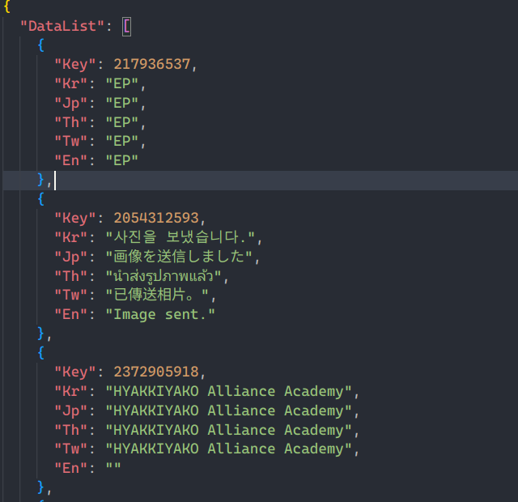
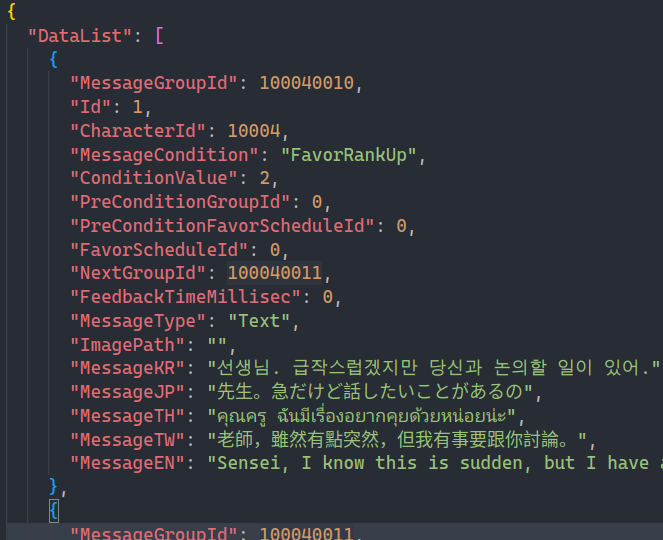
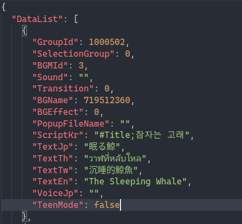
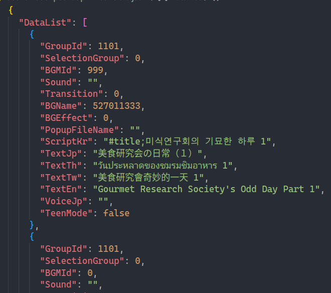
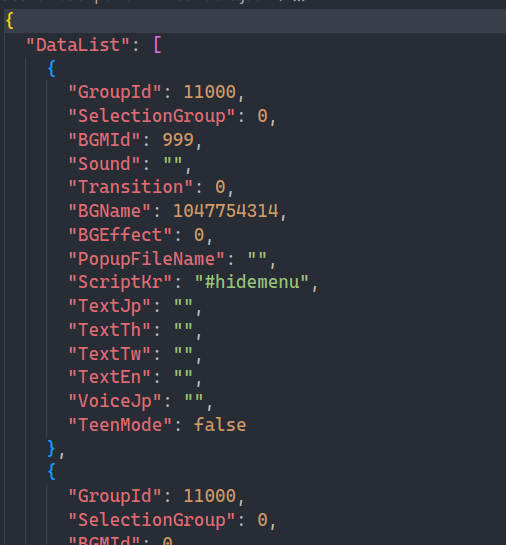
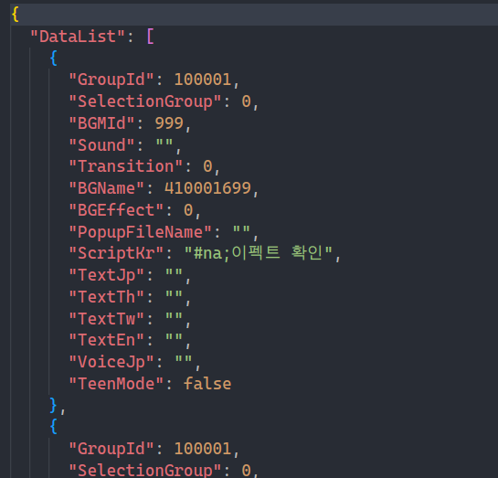
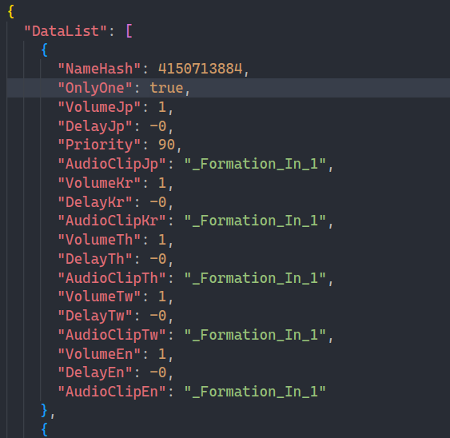
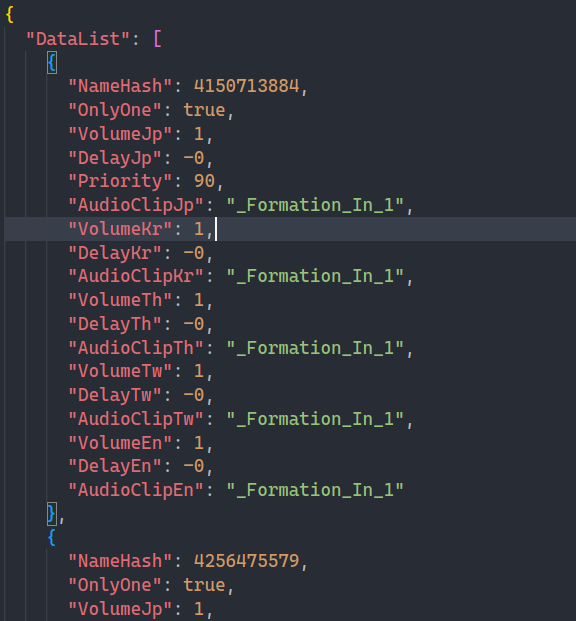

| 文件名                          | 描述            | 结构                                                         |
| ------------------------------- | --------------- | ------------------------------------------------------------ |
| Excel/LocalizeScenarioExcelTable.json | 羁绊剧情的 i18n |  |
| Excel/AcademyMessanger1ExcelTable.json | momotalk 消息 ||
| Excel/ScenarioScriptFavor1ExcelTable.json | 学生羁绊剧情 ||
| Excel/ScenarioScriptGroup1ExcelTable.json | 组织羁绊剧情 ||
| Excel/ScenarioScriptMain1ExcelTable.json | 主线剧情 ||
| Excel/ScenarioScriptTestExcelTable.json | 测试剧情（不清楚） ||
| HexaMap/ | 六面图（走格子） ||
| Stage/ | 关卡怪物生成 ||
| Excel/AcademyFavorScheduleExcelTable.json | 羁绊剧情回忆选择界面（结合 Excel/LocalizeScenarioExcelTable.json 使用） ||
| | ||
| | ||
| | ||
| | ||

